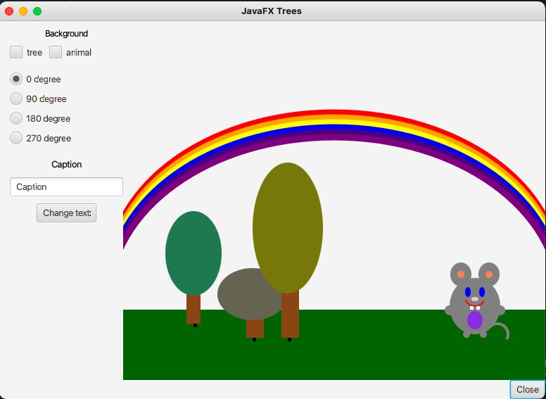
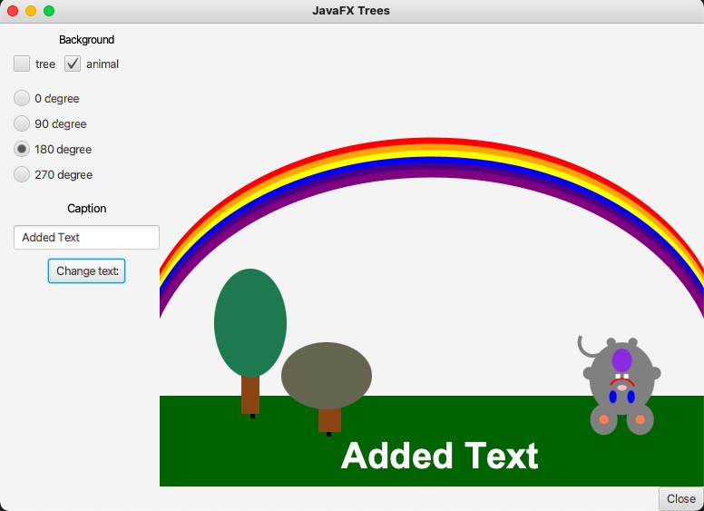

## GUI Application
The GUI application is a java program and ipmlements concepts of object oriented, inheritence, and JavaFX to create some objects such as a scene with an animal.
This application has some radio buttons to rotate the animal or a tree from a base point, check boxes to hidden or show the tree or the animal, and text box to add a text into the scene*.

## Skills in this game:
- Java syntax and related libraries
- Object oriented and inheritence
- events, event handlers, listeners

