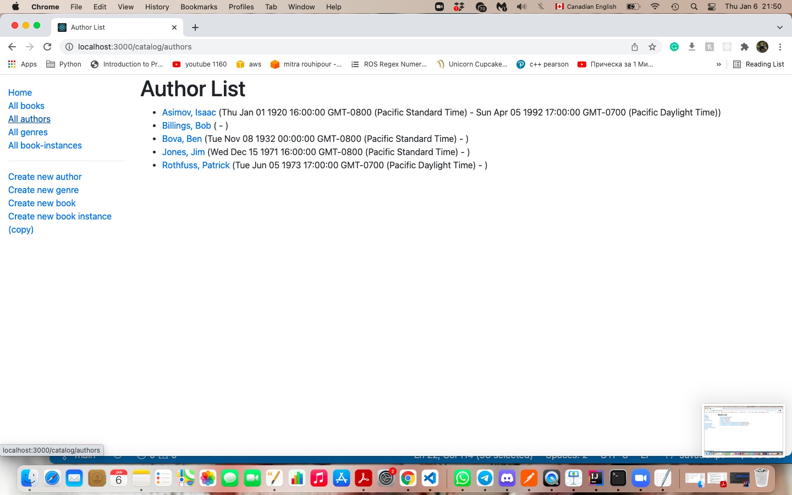

## Local Library Application
This is an Application to manage records of a local library, using Node.js, Express.It is based on a tutorial available on [MDN Web Docs](https://developer.mozilla.org/en-US/docs/Learn/Server-side/Express_Nodejs/Tutorial_local_library_website)

## Skills for This Application:
- Node.js and Express 
- Server Side Implementation
- Designing Data Base
- Model Control View artitecture design
- Using MongoDB data base and mongoose package 
- Routing and HTTP Request

