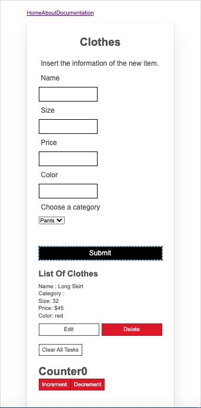

## Online Store Application
This is a front-end application using react libraries to add a 
new product into the store base on its name, price, category, size 
, and color. The main feauture of this application is a form to inser 
the new data and add a product into the store by using Submit button.
Also each product is edditable by price by clicking Edit button and 
also the client can delete the product by click on Delete button.
Furtheremore there are two buttons, for increment and decrement the 
counter by using redux as global variables.Also, the Clear All Task 
button can clear the local storage. And finally there is a navBar by 
using Routing on top of the application.

## The Main Features OF This App:
- Created Seven Components in React app and props between local variables and components
- Implemented event handlersfor interactivity by adding, deleting and editing an item
- Maked use of localStorage to persist some state
- Used global state by using Redux for implementing Increment and Decrement Buttons
- Created client-site routing for a single page

            